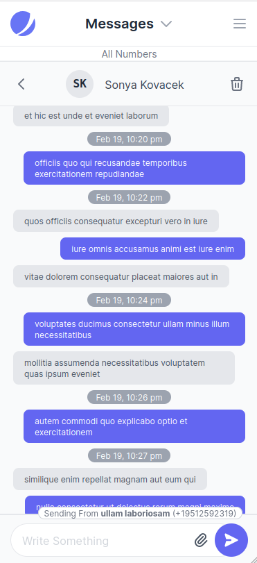
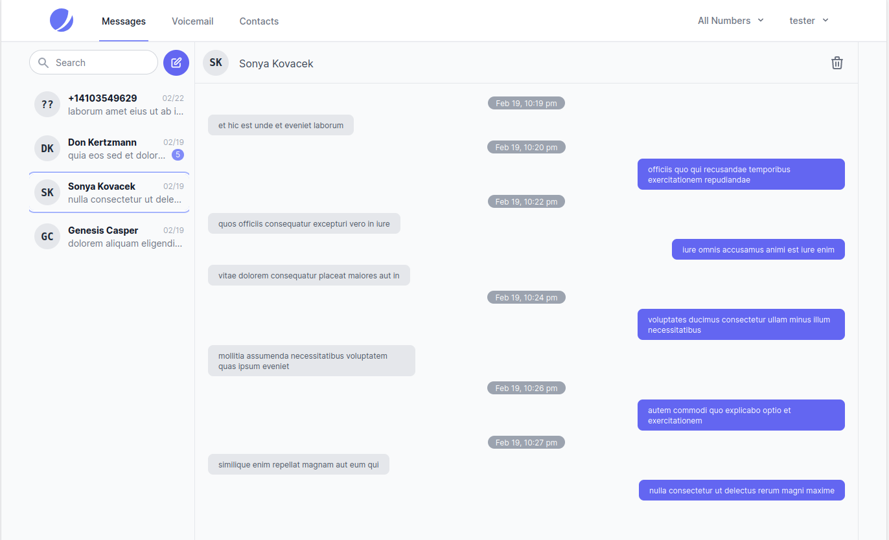
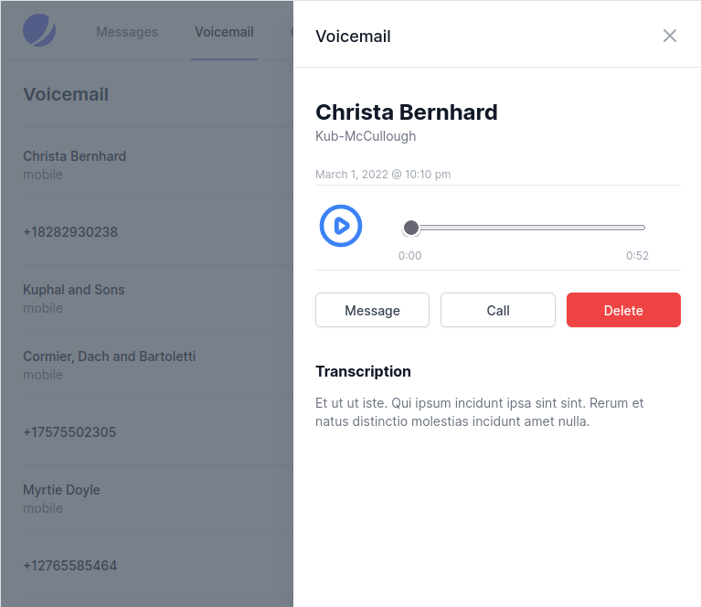
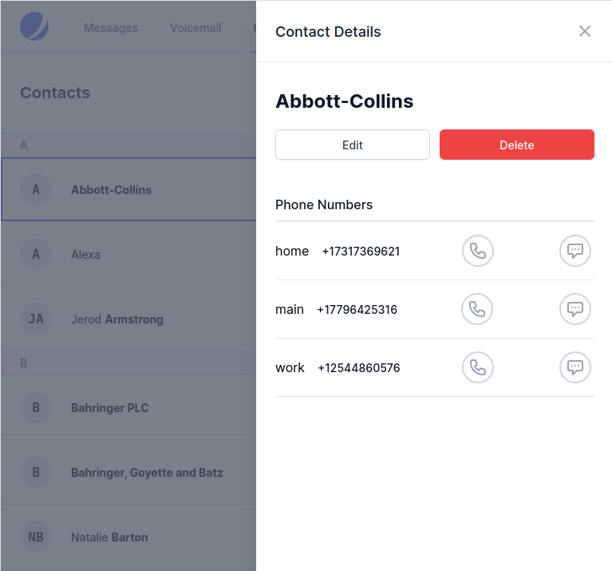
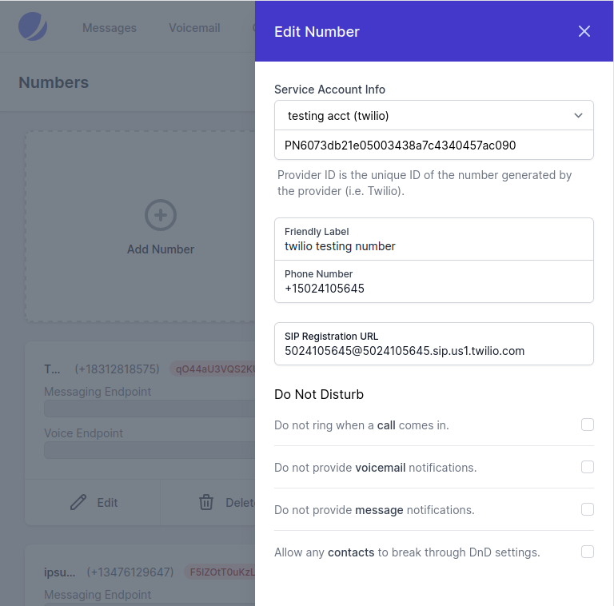

# Hellechat

## About
Hellechat is a SMS, MMS and Voicemail handling web application that can be used in conjunction with Voice Over IP (VOIP) telephone service.  VOIP platforms such as Twilio, Telnyx, Signalwire etc. most often handle VOIP using the SIP protocol, and require the phone number to be ported to their platform.  These services expect you to handle messaging with your own application, and there aren't widely used open source options for this purpose like there are for voice  with soft phones.

Hellechat allows you to send and receive SMS and MMS messages through a mobile, responsive web interface.

Contact management is integrated for quick access to send to, and recognize messages from your contacts.  Import of vcard files exported from your mobile device is supported along with manual entry.

Lite call control can be handled with configuration for Do-Not-Disturb which sends calls straight to voicemail on a number by number, or contact relative basis.

Push notifications for voicemail and messages are implemented through the open source [Gotify](https://gotify.net/) server and can be received through subscription using the Gotify mobile application for Android.  Gotify was selected to allow for push notifications that don't rely on Google Play Services.

## Screenshots

## Security Vulnerabilities

Please review [the security policy](https://github.com/brianwebb01/hellechat/security/policy) on how to report security vulnerabilities.

## License

The Hellechat application is open-sourced software licensed under the [MIT license](https://github.com/brianwebb01/hellechat/blob/master/LICENSE.md).
